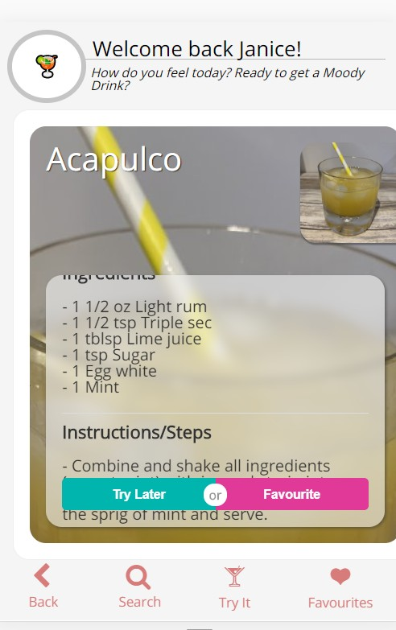
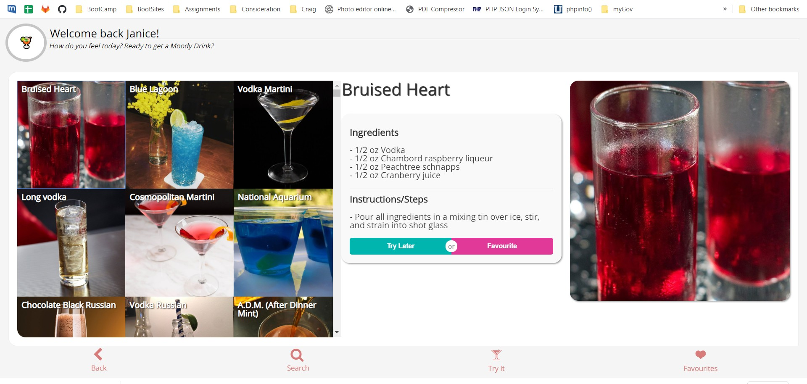
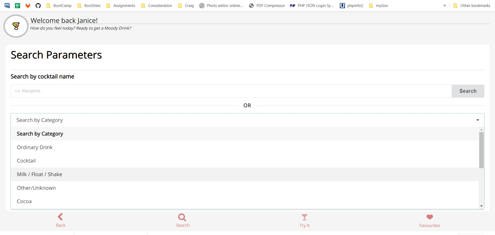

# Moody Drinks

Moody Drinks is an app to recommend drinks depending on the user's current mood. 

## Highlights

- The drinks are recommended with pictures, drinking instructions, and ingredients. They are in random order but retrieved according to the mood category chosen by users.
- Users can search a particular drink by name, by ingredient (currently unavailable) or by category.
- For every drink, users can save it to a Favourites category or a Try It Later category, and the data persists.
  - NB -[BUG] Removing a drink from the categories is currently unavailable in this version.
- The app is responsively designed to work across multiple devices.
- The interface is interactive and user friendly. 

### Web Link:

To view our demo, visit the link below:
https://zypherone.github.io/moody-drinks/

### Slides Link:

https://drive.google.com/file/d/1LxyQzv8Qxk-nWRzTNMvCCs_SRvGdIbCu/view?usp=sharing

## Screenshots of examples

